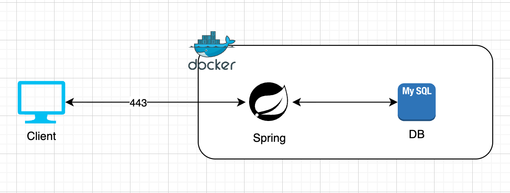
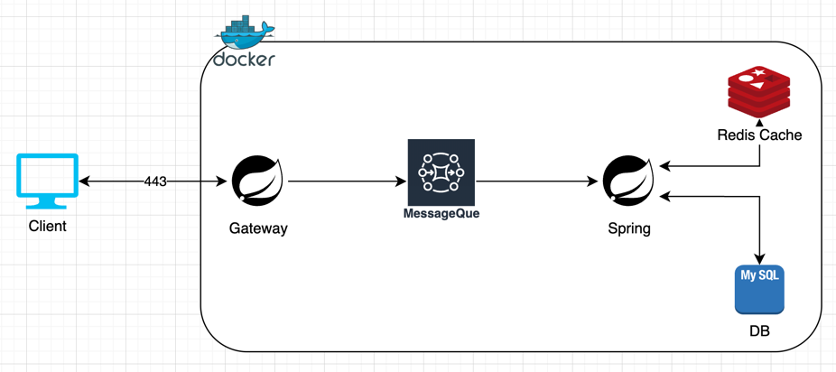

## 인프라 구성도

### 기본 인프라 구성도

기본 인프라 구성도  
Spring MVC API를 통해 직접 Client 요청을 받는다.  
MySQL DB를 사용해 데이터 관리를 한다.

### 고도화 인프라 구성도

추후 고도화 될 인프라 구성도  
대기열 고도화를 위해 추후에 MessageQue가 필요할 것으로 생각됨  
Gateway를 통해 MessageQue에 순서대로 대기요청을 적재하여 전체적인 동시성을 유지함.  
또한 대기열 토큰의 만료시간을 쉽게 관리할 수 있도록 Redis도 필요할 것으로 생각됨.